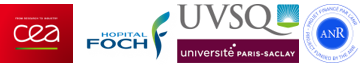

# vocDB: Building the reference atomic and VOC annotation tables from the **ptairMS** package

**Authors:** Camille Roquencourt, Paul Zheng, Pierrick Roger-Mele and Etienne A. Thévenot ([**Data Sciences for Deep Phenotyping and Precision Medicine team**](http://etiennethevenot.pagesperso-orange.fr/) at CEA)

**In partnership with:** Stanislas Grassin-Delyle, Hélène Salvator, Emmanuel Naline, Philippe Devillier and Louis-Jean Couderc ([**Exhalomics platform**](https://www.pluginlabs-universiteparissaclay.fr/fr/entity/915199-exhalomics-plateforme-danalyse-de-lair-expire) at the Foch Hospital)

**Databases:** The current versions of the tables of atomic weights and VOC data are based on:

* [**Commission on Isotopic Abundances and Atomic Weights**](http://www.ciaaw.org/atomic-masses.htm)

* [**Human Breathomics Database**](https://hbdb.cmdm.tw) ([Kuo et al., 2020](https://doi.org/10.1093/database/baz139))

* [**PubChem**](https://pubchem.ncbi.nlm.nih.gov) ([Kim et al., 2019](https://doi.org/10.1093/nar/gky1033))

**Funding:** The [**SoftwAiR project**](https://anr.fr/Projet-ANR-18-CE45-0017) is supported by the Agence Nationale de la Recherche (ANR-18-CE45-0017 grant).

